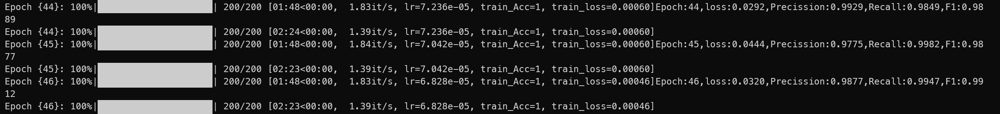

<!-- PROJECT LOGO -->

 

  <!--  -->

  <h3 align="center">Hybrid_ViT</h3>

  

    A reproduction of the <a href="https://arxiv.org/abs/2010.11929"><strong>ViT  Paper</strong></a>
     
    <a href="https://github.com/Polarisjame/Bitmoji_Hybrid_ViT/tree/main/Hybrid_ViT_%E5%91%A8%E5%87%8C%E5%B3%B0"><strong>Explore the docs »</strong></a>
     
  

<!-- TABLE OF CONTENTS -->

  
Table of Contents

  <ol>
    <li>
      <a href="#about-the-project">About The Project</a>
      <ul>
        <li><a href="#resnet34">ResNet34</a></li>
        <li><a href="#vit">ViT</a></li>
      </ul>
    </li>
    <li>
      <a href="#getting-started">Getting Started</a>
      <ul>
        <li><a href="#requirements">Requirements</a></li>
        <li><a href="#dataset">Dataset</a></li>
      </ul>
    </li>
    <li>
      <a href="#training-and-testing">Training and Testing</a>
      <ul>
        <li><a href="#train">Train</a></li>
        <li><a href="#test">Test</a></li>
      </ul>
    </li>
  </ol>

<!-- ABOUT THE PROJECT -->
## About The Project

该模型由ResNet34以及ViT组成,在此基础上加入Re_Zero以及GatedAttention优化，及对模型的残差连接部分以及自注意力部分做了改动。最终输出对输入人脸图片的性别预测。

### ResNet34

模型参考[ResNet](./utils/ResidualNet.py)
原论文使用的是ResNet50，这里为了减少参数量用了ResNet34，也将最后两层残差层合并，在PatchEmbedding中用1*1的卷积核得到EmbeddingSize的通道。

### ViT

结构同原论文，最后只提取CLS Token的特征作为分类向量

(<a href="#readme-top">back to top</a>)

<!-- GETTING STARTED -->
## Getting Started

### Requirements

My code works with the following environment.

* `python=3.7`
* `pytorch=1.12.1+cu116`
* tqdm
* numpy
* pandas
* sklearn
* einops
* PIL

### Dataset

Download data from [`Bitmojidata`](https://drive.google.com/file/d/1atMwmdOJe_fqG8Tyg5eqxZ-iDyPxDJOR/view?usp=sharing), Put all files you download under **./data/Bitmojidata**

(<a href="#readme-top">back to top</a>)

<!-- Training and Testing -->
## Training and Testing

### Train

* You can run `python train.py` to train a **Hybrid_ViT Model** in cmd line and `python train.py -h` to get help.

* To train a **ResNet34 Model**, you can run `python train.py --use_only_res34 True`

* To train a **pure ViT Model**, you can run `python train.py --use_only_res34 False --use_hybrid False`

Here are some important parameters:

* `--batch_size`
* `--re_zero`: Use Re_zero in ResNet if True
* `--learning_rate`
* `--epochs`
### Test

Your trained model named 'model_epoch.pth' and loss/acc figure is saved under ./checkpoint,model is saved every 5 epochs.
You need to replace the code in test(args, model, data, device) in [train.py](train.py) to predict the test data with your saved model.
The result file will be saved as'out_epoch.csv'.

Here are My Train Example:

(<a href="#readme-top">back to top</a>)

